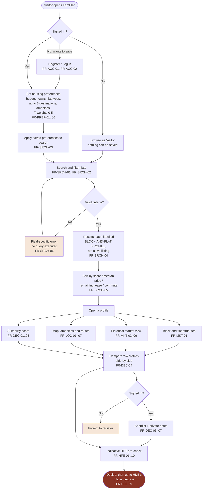
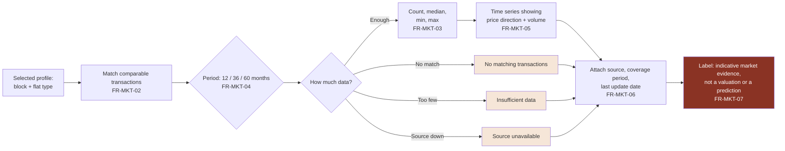
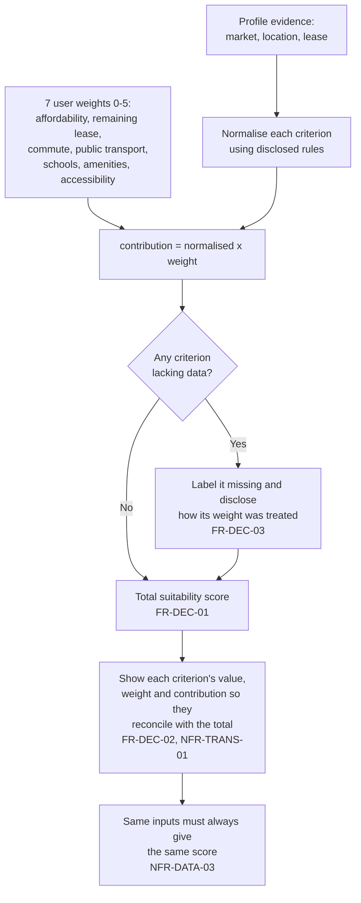
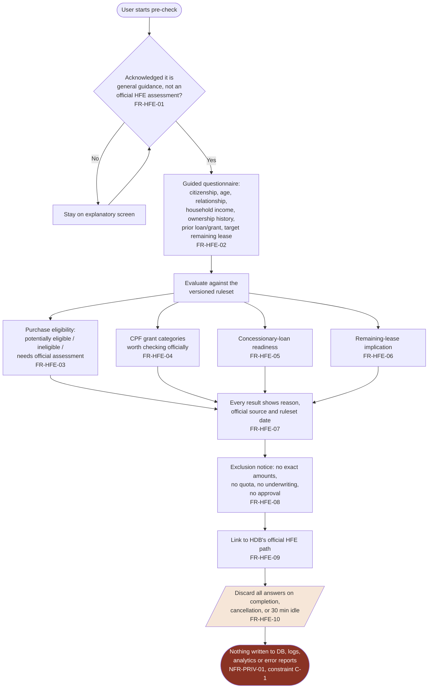
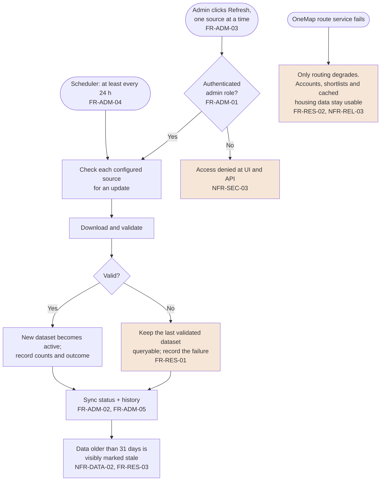

# Lab 1 Explainer — What we built and how FamPlan works

A plain-English walkthrough of the Lab 1 deliverable for the team. Read this first, then dive
into the detailed documents it points at.

---

## 1. What Lab 1 actually is

Lab 1 is **requirements engineering, not code**. Nothing here is implemented. The deliverable is
the agreed description of the system: who uses it, what it must do, how well it must do it, and
what it deliberately will not do. Everything in Labs 2+ (design, implementation, testing) is
traced back to the identifiers written here.

### Files in `Lab1/`

| File | What it is | Why it exists |
|---|---|---|
| `Functional and Non-Functional Requirements.md` | The SRS. Project name, mission, problem, users, data sources, assumptions/constraints, out-of-scope, then ~60 functional requirements (FR-*) and ~30 non-functional requirements (NFR-*). | The contract. Every FR is atomic, has an actor, an input, a required output, and a verification method. |
| `Use Case Descriptions.md` | 18 use cases across 8 groups, each with actor, preconditions, main flow, alternate/exception flows, postconditions. | Turns the static FR list into user-visible interactions. |
| `Data Dictionary.md` | Every entity and attribute the system stores or computes (User Account, Block-and-Flat Profile, Resale Transaction, Suitability Score, Route Estimate, …). | Fixes the vocabulary so we all mean the same thing by "profile" or "comparable set". |
| `diagrams/FamPlan_Use_Case_Diagram.drawio.png` | The UML use case diagram (actors ↔ use cases, «include»/«extend»). | The one-page picture of system scope. |
| `ui_mockups/<screen>/` | 11 screens, each with `code.html` and `screen.png`. | Shows what the requirements look like as an interface, in the shared "warm institutional" palette. |
| `review/` | `SRS_Review_IEEE830.md`, `Diagram_Critique.md`, `Traceability_Matrix.md`, `CONTEXT.md`. | Self-assessment against IEEE 830 plus the FR ↔ use case ↔ screen traceability check. |

---

## 2. The product in one paragraph

**FamPlan** helps a Singapore household decide which **HDB resale flats** are worth considering.
It is *not* a marketplace — there are no live listings, no agents, no transactions. Instead it
assembles what is already published about a block and flat type (historical resale transactions,
nearby schools, transport and amenities, travel time to the places the household actually goes,
and an indicative financing pre-check) into one comparable view, plus a **suitability score the
household weights itself**.

Three rules run through every requirement:

1. **Every figure carries its source and retrieval date** (NFR-DATA-01).
2. **Every gap in the evidence is named, never hidden** — "no matching transactions",
   "insufficient data" and "source unavailable" are three different states, never a zero
   (FR-MKT-08).
3. **Anything touching money or eligibility is labelled indicative, not official**
   (FR-MKT-07, FR-HFE-08, NFR-TRANS-02).

---

## 3. Actors

| Actor | Can do |
|---|---|
| **Visitor** (not logged in) | Search and filter, view profiles and market history, view map/amenities/routes, compare, run the HFE pre-check. **Saves nothing.** |
| **Registered user** | Everything above, plus saved preferences and weights, a shortlist, and private notes. |
| **Data administrator** | Everything above, plus sync status, manual per-source refresh, and sync history. |
| **System** (scheduled) | Checks each source at least every 24 h; keeps the last validated dataset if a refresh fails. |

---

## 4. Data sources

All five are public, none costs money.

| Source | Gives us | Feeds |
|---|---|---|
| HDB Resale Flat Prices (data.gov.sg) | Historical transactions | FR-MKT-02…05 |
| HDB Property Information (data.gov.sg) | Block attributes | FR-MKT-01 |
| MOE School Directory (data.gov.sg) | School names/addresses (**no coordinates — must be geocoded**) | FR-LOC-02 |
| OneMap (SLA) | Geocoding, map, routing, barrier-free routing, nearby places | FR-LOC-01…07 |
| LTA DataMall static train stations | MRT/LRT coordinates | FR-LOC-02 |

Two gotchas that shape the whole data model:

- **The two HDB datasets share no town key.** Resale names towns in full (`BUKIT MERAH`),
  Property uses a 3-letter code. We join on *normalised block + normalised street*, and we
  **measure and report the unmatched rate** in the admin view rather than assume it is zero.
- **Remaining lease is derived from a year only**, so it is accurate to ±12 months. That caveat
  is shown on screen wherever the figure appears.

---

## 5. How the web app works — end to end

### 5.1 The market panel — how a number gets on screen

The three shaded boxes are the point of **FR-MKT-08**: they are distinct states and must never
collapse into "$0" or a blank chart.

### 5.2 The suitability score — why it must be explainable

Two constraints do the heavy lifting here: the breakdown must **add up to the total** (subject
only to documented rounding), and the score must be **reproducible** across restarts. That rules
out any hidden randomness or undated data in the calculation.

### 5.3 The HFE pre-check — the privacy-critical path

**This is the one requirement most likely to be broken by accident.** Constraint C-1 says it is
enforced *architecturally* — a request-scoped object with no serialiser to any sink — not by
everyone remembering not to log things. One stray `console.log` breaches NFR-PRIV-01.

### 5.4 Data administration and resilience

---

## 6. How the eight requirement groups map to the screens

| Group | Requirements | Use cases | Mockup folder |
|---|---|---|---|
| Account management | FR-ACC-01…06 | 1.1–1.5 | `sign_in_register/` |
| Housing preferences | FR-PREF-01…06 | 2.1 | `advanced_search_saved_preferences_fr_srch_03/` |
| Search and discovery | FR-SRCH-01…06 | 3.1–3.2 | `explore_hdb_resale_flats_warm_institutional/` |
| Property and market info | FR-MKT-01…08 | 4.1–4.2 | `property_profile/` |
| Location, travel, amenities | FR-LOC-01…07 | 5.1–5.2 | `commute_route_details/`, `family_school_cca_highlights_added/` |
| Decision support, shortlist | FR-DEC-01…07 | 6.1–6.3 | `compare_shortlist_final_warm_institutional_corrected/` |
| Indicative HFE pre-check | FR-HFE-01…10 | 7.1 | `hfe_eligibility_warm_red/`, `financial_roadmap_payment_schedule/` |
| Admin and resilience | FR-ADM-01…05, FR-RES-01…03 | 8.1–8.3 | `admin_sync_dashboard/` |

Shared palette: `ui_mockups/warm_institutional_colour_pallette/`.

---

## 7. The non-functional targets worth memorising

These are the numbers a marker will check, and the ones that will constrain our Lab 2 design.

- **Performance** — search/filter p95 ≤ 2 s at 100 concurrent users over ≥ 1,000,000 transaction
  rows, external API time excluded (NFR-PERF-01). Scoring/compare p95 ≤ 3 s (NFR-PERF-02).
  Live route p95 ≤ 5 s (NFR-PERF-03).
- **Scale** — ≥ 1,000,000 rows indexed on block, flat type and date; ≥ 100 concurrent users
  (NFR-SCALE-01/02, constraint C-2).
- **Accessibility** — WCAG 2.1 AA on all core workflows, full keyboard operation with a visible
  focus indicator (NFR-ACC-01/02). This is why FR-MKT-05 requires a text or table equivalent of
  the chart, and why barrier-free routing gets its own requirement (FR-LOC-06).
- **Compatibility** — usable from 360 px to 1440 px with no horizontal scrolling (NFR-COMP-01).
- **Security** — TLS 1.2+, salted password hashes never in logs, lockout for 15 min after 5
  failed logins, allow-list/structural validation on all input (NFR-SEC-01…05).
- **Privacy** — HFE answers never persisted (NFR-PRIV-01); deleted accounts irretrievable within
  24 h (NFR-PRIV-02); no data collected beyond what is needed (NFR-PRIV-03).
- **Maintainability** — source endpoints, scoring constants and HFE rules live in versioned
  configuration or isolated modules, so one can change without touching workflow code
  (NFR-MAINT-01). Design accordingly in Lab 2.

---

## 8. What FamPlan is deliberately *not*

Say this out loud in the presentation — the scope boundary is a graded decision, not a gap.

- **Not a marketplace**: no live listings, no offers or bookings, no agents or sellers.
- **Not an authority**: no official HFE assessment, no exact grant or loan amounts, no
  valuation, no future-price prediction, no financial advice.
- **Not the whole market**: resale HDB only — no BTO, SBF, private property, EC or rental.
- **Not beyond the data**: no unit condition, renovation state, interior photos or floor plans
  (they are not published); no user reviews; no email/push notifications; no native mobile app.

---

## 9. How to read the documents, in order

1. **This file** — the map.
2. `Functional and Non-Functional Requirements.md` §1–§7 — project, problem, users, sources,
   assumptions, scope. Everything conceptual is here.
3. `diagrams/FamPlan_Use_Case_Diagram.drawio.png` — the one-page picture.
4. `Use Case Descriptions.md` — pick the two or three use cases you own and know their alternate
   and exception flows cold; that is where questions land.
5. `Functional and Non-Functional Requirements.md` §9–§10 — the FR/NFR tables, as reference.
6. `Data Dictionary.md` — when you are unsure what an entity means.
7. `review/` — the self-critique, including the traceability matrix.
